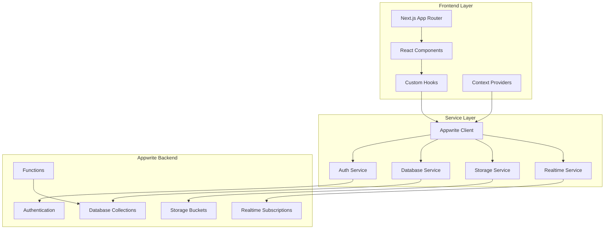
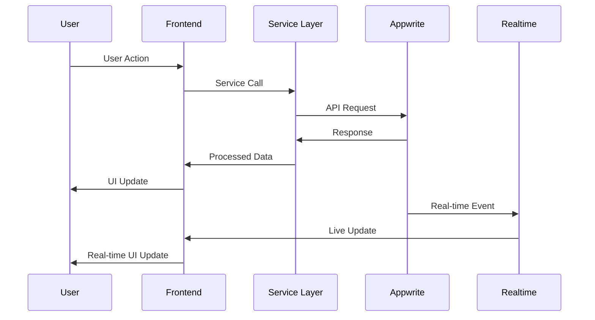

# Design Document

## Overview

This design outlines the complete integration of Appwrite backend services into the Madhubani Nikah Islamic matrimony platform. The integration will transform the current mock-data driven application into a production-ready platform with real-time database operations, comprehensive authentication, file storage, and advanced matching capabilities.

The design follows a modular architecture with clear separation of concerns, utilizing Appwrite's built-in services for authentication, database, storage, and real-time features while maintaining the existing Next.js frontend structure.

## Architecture

### High-Level Architecture



### Data Flow Architecture



## Components and Interfaces

### 1. Appwrite Configuration

**File: `src/lib/appwrite.ts`**
- Centralized Appwrite client configuration
- Environment-based endpoint and project ID setup
- Service instances for Auth, Database, Storage, and Functions

**File: `src/lib/appwrite-config.ts`**
- Database and collection IDs constants
- Storage bucket IDs
- Function IDs and endpoints
- Permission templates

### 2. Authentication Service

**File: `src/lib/services/auth.service.ts`**

```typescript
interface AuthService {
  // Registration
  registerWithEmail(email: string, password: string, name: string): Promise<AuthResult>
  registerWithPhone(phone: string): Promise<OTPResult>
  verifyPhoneOTP(userId: string, secret: string, otp: string): Promise<AuthResult>
  
  // Login
  loginWithEmail(email: string, password: string): Promise<AuthResult>
  loginWithPhone(phone: string): Promise<OTPResult>
  
  // Session Management
  getCurrentUser(): Promise<User | null>
  logout(): Promise<void>
  
  // Profile Integration
  createUserProfile(userId: string, profileData: ProfileData): Promise<Profile>
}
```

### 3. Profile Service

**File: `src/lib/services/profile.service.ts`**

```typescript
interface ProfileService {
  // CRUD Operations
  createProfile(profileData: CreateProfileData): Promise<Profile>
  getProfile(userId: string): Promise<Profile | null>
  updateProfile(userId: string, updates: Partial<Profile>): Promise<Profile>
  deleteProfile(userId: string): Promise<void>
  
  // Search and Filtering
  searchProfiles(filters: SearchFilters): Promise<SearchResult>
  getRecommendedMatches(userId: string): Promise<Profile[]>
  
  // Profile Management
  uploadProfilePicture(userId: string, file: File): Promise<string>
  updateProfileVisibility(userId: string, visibility: VisibilitySettings): Promise<void>
  getProfileStats(userId: string): Promise<ProfileStats>
}
```

### 4. Interest Management Service

**File: `src/lib/services/interest.service.ts`**

```typescript
interface InterestService {
  // Interest Operations
  sendInterest(senderId: string, receiverId: string, message?: string): Promise<Interest>
  respondToInterest(interestId: string, response: 'accepted' | 'declined'): Promise<Interest>
  withdrawInterest(interestId: string): Promise<void>
  
  // Interest Queries
  getSentInterests(userId: string): Promise<Interest[]>
  getReceivedInterests(userId: string): Promise<Interest[]>
  getMutualInterests(userId: string): Promise<Interest[]>
  
  // Interest Analytics
  getInterestStats(userId: string): Promise<InterestStats>
}
```

### 5. Real-time Service

**File: `src/lib/services/realtime.service.ts`**

```typescript
interface RealtimeService {
  // Notification Subscriptions
  subscribeToNotifications(userId: string, callback: NotificationCallback): () => void
  subscribeToInterests(userId: string, callback: InterestCallback): () => void
  
  // Profile Updates
  subscribeToProfileUpdates(userId: string, callback: ProfileCallback): () => void
  
  // Online Status
  updateOnlineStatus(userId: string, isOnline: boolean): Promise<void>
  subscribeToOnlineStatus(userIds: string[], callback: OnlineStatusCallback): () => void
}
```

### 6. Storage Service

**File: `src/lib/services/storage.service.ts`**

```typescript
interface StorageService {
  // File Upload
  uploadProfilePicture(file: File, userId: string): Promise<FileUploadResult>
  uploadVerificationDocument(file: File, userId: string): Promise<FileUploadResult>
  
  // File Management
  getFilePreview(bucketId: string, fileId: string, options?: PreviewOptions): string
  deleteFile(bucketId: string, fileId: string): Promise<void>
  
  // File Validation
  validateFile(file: File, type: 'image' | 'document'): ValidationResult
}
```

## Data Models

### 1. Enhanced Profile Model

```typescript
interface Profile {
  // Core Identity
  userId: string
  name: string
  age: number
  gender: 'male' | 'female'
  email: string
  
  // Geographical Information
  district: string
  block: string
  village?: string
  nearbyDistricts?: string[]
  
  // Education & Career
  education: string
  occupation: string
  skills?: string[]
  
  // Religious & Cultural
  sect: 'Sunni' | 'Shia' | 'Other'
  subSect?: string
  biradari?: string
  religiousPractice: string
  familyBackground: string
  
  // Personal Details
  bio: string
  familyType?: 'nuclear' | 'joint'
  maritalStatus: 'single' | 'divorced' | 'widowed'
  
  // Profile Settings
  profilePictureId?: string
  isPhotoBlurred: boolean
  isVerified: boolean
  isProfileComplete: boolean
  profileVisibility: 'public' | 'members' | 'private'
  
  // Preferences
  lookingFor?: PartnerPreferences
  ageRangePreference?: string
  locationPreference?: string[]
  educationPreference?: string[]
  
  // System Fields
  createdAt: string
  updatedAt: string
  lastActiveAt?: string
  profileViewCount: number
  isActive: boolean
}
```

### 2. Interest Model

```typescript
interface Interest {
  $id: string
  senderId: string
  receiverId: string
  status: 'pending' | 'accepted' | 'declined' | 'withdrawn'
  message?: string
  sentAt: string
  respondedAt?: string
  type: 'proposal' | 'favorite' | 'contact_request'
  isRead: boolean
  aiMatchScore?: number
  commonInterests?: string[]
}
```

### 3. Notification Model

```typescript
interface Notification {
  $id: string
  userId: string
  type: 'new_interest' | 'interest_accepted' | 'interest_declined' | 'new_match' | 'profile_view' | 'verification_update' | 'system_announcement'
  title: string
  message: string
  isRead: boolean
  priority: 'low' | 'medium' | 'high'
  createdAt: string
  readAt?: string
  relatedUserId?: string
  actionUrl?: string
  metadata?: Record<string, any>
}
```

## Error Handling

### 1. Error Types and Handling Strategy

```typescript
enum AppwriteErrorType {
  AUTHENTICATION_ERROR = 'auth_error',
  PERMISSION_ERROR = 'permission_error',
  VALIDATION_ERROR = 'validation_error',
  NETWORK_ERROR = 'network_error',
  RATE_LIMIT_ERROR = 'rate_limit_error',
  STORAGE_ERROR = 'storage_error'
}

interface ErrorHandler {
  handleAuthError(error: AppwriteException): AuthErrorResponse
  handleDatabaseError(error: AppwriteException): DatabaseErrorResponse
  handleStorageError(error: AppwriteException): StorageErrorResponse
  handleNetworkError(error: AppwriteException): NetworkErrorResponse
}
```

### 2. Error Recovery Mechanisms

- **Automatic Retry**: Implement exponential backoff for transient errors
- **Offline Support**: Cache critical data for offline access
- **Graceful Degradation**: Fallback to limited functionality when services are unavailable
- **User Feedback**: Clear error messages with actionable suggestions

### 3. Error Logging and Monitoring

```typescript
interface ErrorLogger {
  logError(error: AppwriteException, context: ErrorContext): void
  trackUserAction(action: string, success: boolean, metadata?: any): void
  reportCriticalError(error: CriticalError): void
}
```

## Testing Strategy

### 1. Unit Testing

**Test Coverage Areas:**
- Service layer functions
- Data transformation utilities
- Validation functions
- Error handling logic

**Testing Framework:** Jest with React Testing Library

### 2. Integration Testing

**Test Scenarios:**
- Authentication flows (email/password, phone/OTP)
- Profile CRUD operations
- Interest management workflows
- Real-time notification delivery
- File upload and storage operations

### 3. End-to-End Testing

**Critical User Journeys:**
- User registration and profile creation
- Profile search and filtering
- Interest sending and response
- Profile verification process
- Admin moderation workflows

### 4. Performance Testing

**Performance Metrics:**
- Database query response times
- File upload/download speeds
- Real-time notification latency
- Search result rendering performance

### 5. Security Testing

**Security Validations:**
- Authentication bypass attempts
- Permission boundary testing
- File upload security validation
- Data privacy compliance
- Rate limiting effectiveness

## Implementation Phases

### Phase 1: Core Infrastructure Setup
- Appwrite CLI configuration and database setup
- Basic authentication implementation
- Profile CRUD operations
- File storage integration

### Phase 2: Advanced Features
- Search and filtering system
- Interest management
- Real-time notifications
- Profile verification system

### Phase 3: AI and Analytics
- AI-powered matching algorithms
- Search analytics tracking
- User behavior insights
- Performance optimization

### Phase 4: Admin and Moderation
- Admin dashboard integration
- User report management
- Content moderation tools
- Platform settings management

### Phase 5: Production Optimization
- Performance tuning
- Security hardening
- Monitoring and logging
- Backup and recovery procedures

## Security Considerations

### 1. Authentication Security
- Secure session management
- Password strength requirements
- OTP validation and expiry
- Account lockout mechanisms

### 2. Data Privacy
- Profile visibility controls
- Photo privacy settings
- Contact information protection
- GDPR compliance measures

### 3. File Security
- File type validation
- Virus scanning integration
- Secure file access URLs
- Automatic file cleanup

### 4. API Security
- Rate limiting implementation
- Request validation
- Permission-based access control
- Audit logging

## Performance Optimization

### 1. Database Optimization
- Compound indexes for complex queries
- Query result pagination
- Data caching strategies
- Connection pooling

### 2. File Storage Optimization
- Image compression and optimization
- CDN integration for global delivery
- Lazy loading for profile images
- Progressive image loading

### 3. Real-time Optimization
- Selective subscription management
- Connection pooling for WebSocket
- Message queuing for high traffic
- Graceful connection handling

### 4. Frontend Optimization
- Component lazy loading
- State management optimization
- Bundle size optimization
- Service worker caching