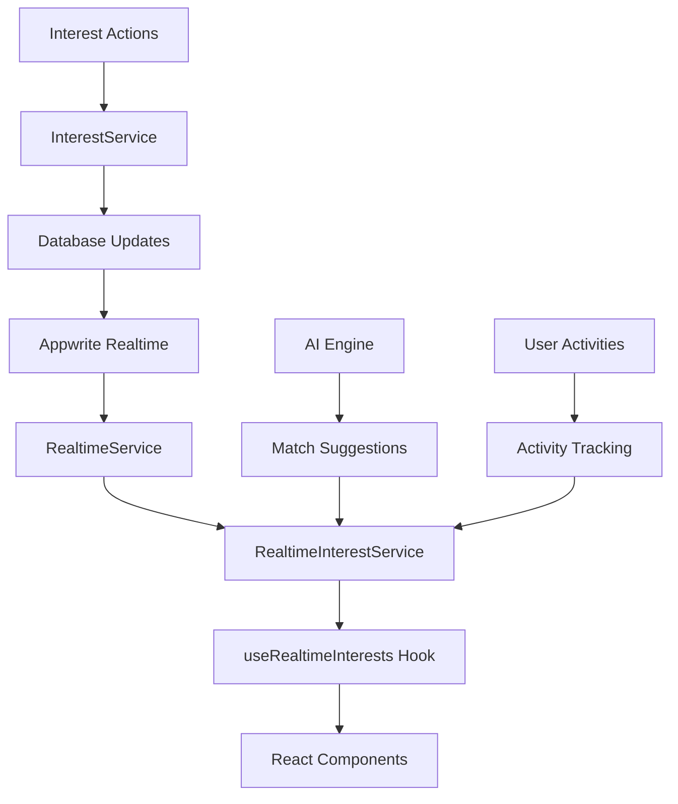

# Real-time Interest Updates

This document describes the implementation of real-time interest updates for the Madhubani Nikah platform, providing live updates for interest activities, match suggestions, and user engagement analytics.

## Overview

The real-time interest updates system provides:

- **Live Interest Updates**: Real-time notifications when interests are sent, received, accepted, or declined
- **Interest Count Statistics**: Live updating counters for sent, received, unread, and mutual interests
- **AI Match Suggestions**: Intelligent match recommendations based on user preferences and activity
- **Live Activity Feed**: Real-time activity tracking for user engagement

## Architecture

### Core Components

1. **RealtimeInterestService** - Core service handling real-time subscriptions and data processing
2. **useRealtimeInterests** - React hook providing real-time data and actions
3. **RealtimeInterestUpdates** - Main UI component displaying live updates
4. **InterestStatisticsLive** - Live statistics dashboard
5. **LiveActivityFeedComponent** - Activity feed with filtering and controls
6. **RealtimeMatchSuggestions** - AI-powered match suggestions

### Data Flow



## Features

### 1. Real-time Interest Updates

**Functionality:**
- Instant notifications for interest activities
- Enhanced data with profile information
- Action-based filtering (created, updated, deleted)
- Real-time status updates

**Implementation:**
```typescript
// Subscribe to real-time interest updates
const unsubscribe = RealtimeInterestService.subscribeToInterestUpdates(
  userId,
  (data: RealtimeInterestData) => {
    console.log('Interest update:', data);
  }
);
```

**Data Structure:**
```typescript
interface RealtimeInterestData {
  interest: Interest;
  action: 'created' | 'updated' | 'deleted';
  timestamp: string;
  senderInfo?: ProfileInfo;
  receiverInfo?: ProfileInfo;
}
```

### 2. Live Interest Statistics

**Functionality:**
- Real-time count updates for all interest types
- Success rate calculations
- Response rate tracking
- Trend analysis with visual indicators

**Key Metrics:**
- Sent interests count
- Received interests count
- Unread interests count
- Mutual interests count
- Success rate percentage
- Response rate percentage

**Implementation:**
```typescript
// Subscribe to interest count updates
const unsubscribe = RealtimeInterestService.subscribeToInterestCounts(
  userId,
  (data: InterestCountUpdate) => {
    updateCounts(data);
  }
);
```

### 3. AI Match Suggestions

**Functionality:**
- AI-powered compatibility scoring
- Real-time match recommendations
- Common interests analysis
- Personalized match reasons

**Features:**
- Compatibility scores (70-100%)
- Common interests highlighting
- Match quality indicators
- One-click interest sending

**Implementation:**
```typescript
// Subscribe to match suggestions
const unsubscribe = RealtimeInterestService.subscribeToMatchSuggestions(
  userId,
  (suggestion: MatchSuggestion) => {
    displaySuggestion(suggestion);
  }
);
```

### 4. Live Activity Feed

**Functionality:**
- Real-time activity tracking
- Activity type filtering
- Public/private activity separation
- Pause/resume controls

**Activity Types:**
- Interest sent
- Interest received
- Interest accepted
- Interest declined
- Mutual match
- Profile view

**Implementation:**
```typescript
// Subscribe to activity feed
const unsubscribe = RealtimeInterestService.subscribeToActivityFeed(
  userId,
  (activity: LiveActivityFeed) => {
    addToFeed(activity);
  }
);
```

## Components

### RealtimeInterestUpdates

Main component providing comprehensive real-time updates interface.

**Props:**
```typescript
interface RealtimeInterestUpdatesProps {
  className?: string;
  showStats?: boolean;
  showMatchSuggestions?: boolean;
  showActivityFeed?: boolean;
  maxUpdates?: number;
}
```

**Features:**
- Tabbed interface for different update types
- Live connection status indicator
- Minimizable interface
- Auto-scrolling updates

### InterestStatisticsLive

Live statistics dashboard with visual progress indicators.

**Features:**
- Real-time count updates
- Success/response rate calculations
- Trend indicators
- Progress bars for metrics

### LiveActivityFeedComponent

Activity feed with advanced filtering and controls.

**Features:**
- Activity type filtering
- Public/private toggle
- Pause/resume functionality
- Auto-scroll controls
- Activity history management

### RealtimeMatchSuggestions

AI-powered match suggestions with interactive interface.

**Features:**
- Compatibility score visualization
- Common interests display
- One-click interest sending
- Suggestion dismissal
- Match quality indicators

## Usage

### Basic Implementation

```typescript
import { RealtimeInterestUpdates } from '@/components/interests/realtime-interest-updates';

function InterestsPage() {
  return (
    <div>
      <RealtimeInterestUpdates 
        showStats={true}
        showMatchSuggestions={true}
        showActivityFeed={true}
        maxUpdates={15}
      />
    </div>
  );
}
```

### Custom Hook Usage

```typescript
import { useRealtimeInterests } from '@/hooks/useRealtimeInterests';

function CustomComponent() {
  const {
    liveUpdates,
    interestCounts,
    matchSuggestions,
    activityFeed,
    isConnected,
    sendInterest,
    clearLiveUpdates
  } = useRealtimeInterests(userId);

  // Use the data and actions as needed
}
```

### Service-Level Usage

```typescript
import { RealtimeInterestService } from '@/lib/services/realtime-interest.service';

// Subscribe to specific updates
const unsubscribe = RealtimeInterestService.subscribeToInterestUpdates(
  userId,
  (data) => {
    // Handle real-time updates
  }
);

// Send interest with real-time tracking
const interest = await RealtimeInterestService.sendInterestWithRealtime(
  senderId,
  receiverId,
  message
);
```

## Configuration

### Environment Variables

```env
# Appwrite configuration for real-time features
NEXT_PUBLIC_APPWRITE_ENDPOINT=https://your-appwrite-endpoint
NEXT_PUBLIC_APPWRITE_PROJECT_ID=your-project-id
NEXT_PUBLIC_APPWRITE_DATABASE_ID=your-database-id
```

### Real-time Settings

```typescript
// Configure notification preferences
RealtimeService.configureSoundOptions({
  enabled: true,
  volume: 0.7,
  soundType: 'interest'
});

RealtimeService.configureVisualOptions({
  showBrowserNotification: true,
  showToast: true,
  showBadge: true,
  flashTitle: true
});
```

## Performance Considerations

### Subscription Management

- Automatic cleanup on component unmount
- Subscription pooling for multiple components
- Connection state management
- Error recovery mechanisms

### Data Optimization

- Pagination for large datasets
- Selective data loading
- Efficient state updates
- Memory management for live feeds

### Network Efficiency

- WebSocket connection reuse
- Selective subscription channels
- Automatic reconnection handling
- Offline state management

## Testing

### Unit Tests

```typescript
import { testRealtimeInterestUpdates } from '@/lib/test-realtime-interests';

// Test real-time functionality
await testRealtimeInterestUpdates();
```

### Integration Tests

```typescript
// Test complete workflow
const { result } = renderHook(() => useRealtimeInterests(userId));

// Verify real-time updates
expect(result.current.isConnected).toBe(true);
expect(result.current.liveUpdates).toHaveLength(0);
```

## Error Handling

### Connection Issues

- Automatic reconnection attempts
- Graceful degradation to polling
- User notification of connection status
- Offline mode support

### Data Validation

- Real-time data validation
- Error boundary implementation
- Fallback data sources
- User-friendly error messages

## Security

### Data Privacy

- User-specific data filtering
- Permission-based access control
- Secure WebSocket connections
- Data encryption in transit

### Rate Limiting

- Subscription rate limiting
- Action throttling
- Abuse prevention
- Resource usage monitoring

## Future Enhancements

### Planned Features

1. **Advanced AI Matching**
   - Machine learning-based compatibility
   - Behavioral pattern analysis
   - Success rate optimization

2. **Enhanced Analytics**
   - User engagement metrics
   - Conversion tracking
   - A/B testing support

3. **Mobile Optimization**
   - Push notification integration
   - Background sync
   - Offline-first architecture

4. **Social Features**
   - Group activities
   - Community engagement
   - Success story sharing

## Troubleshooting

### Common Issues

1. **Connection Problems**
   - Check Appwrite endpoint configuration
   - Verify network connectivity
   - Review browser console for errors

2. **Missing Updates**
   - Confirm subscription setup
   - Check user permissions
   - Verify database triggers

3. **Performance Issues**
   - Monitor subscription count
   - Check memory usage
   - Optimize component rendering

### Debug Tools

```typescript
// Enable debug logging
RealtimeInterestService.enableDebugMode();

// Check active subscriptions
const count = RealtimeInterestService.getActiveSubscriptionCount();
console.log(`Active subscriptions: ${count}`);

// Test connection
const isConnected = await RealtimeService.testConnection();
console.log(`Connection status: ${isConnected}`);
```

## Conclusion

The real-time interest updates system provides a comprehensive solution for live user engagement in the matrimony platform. It combines real-time data synchronization, AI-powered recommendations, and intuitive user interfaces to create an engaging and responsive user experience.

The modular architecture allows for easy extension and customization while maintaining performance and reliability. The system is designed to scale with user growth and can be enhanced with additional features as needed.